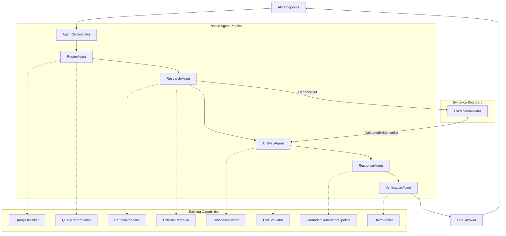

# Phase 6: Unified Native Agent Orchestration

## Overview
Phase 6 resolves the orchestration fragmentation identified in Phase 6A. It replaces the duplicated pipeline orchestration inside the API endpoints (`api/query.py`) and the monolithic legacy orchestrator (`JustiAssistCrew`) with a clean, lightweight native Python agent architecture.

This architecture enforces strict conceptual boundaries, ensuring that evidence is validated before generation, and that external retrieval never bypasses the verification loop.

## Target Architecture

## Agent Responsibilities

### `AgentOrchestrator`
- The single canonical entrypoint for all query endpoints.
- Runs the native agents sequentially.
- Passes `AgentState` through the pipeline.
- Emits unified events for SSE streaming.

### `RouterAgent`
- Determines `QueryType`.
- Expands legal terms and sections.
- Preserves existing semantics without side effects.

### `ResearchAgent`
- Executes `RetrievalPipeline` for local results.
- Executes `ExternalRetriever` if confidence is low or specific triggers met.
- **Hard Invariant**: Automatically runs `EvidenceValidator` to produce the `ValidatedEvidenceSet`.

### `AnalysisAgent`
- Computes bail evaluation heuristics based solely on the `ValidatedEvidenceSet`.

### `ResponseAgent`
- Executes `GroundedGenerationPipeline`.
- **Hard Invariant**: Only accepts `ValidatedEvidenceSet`.

### `VerificationAgent`
- Enforces the strict claim verification boundary.
- Formats final citations from the validated evidence.
- Ensures no unsupported claims reach the user.

## AgentState
An explicit state object (`AgentState`) travels through the pipeline, containing:
- Inputs (`query`, `mode`, `chat_history`, `session_documents`)
- Routing metadata (`query_type`, `reformulated_query`)
- Evidence (`raw_evidence`, `validated_evidence`)
- Analysis (`confidence_score`, `bail_assessment`)
- Generation (`generated_response`, `final_answer`, `citations`)

## Migration
- `api/query.py`: Refactored to completely remove inline orchestration. All routes (`/query`, `/api/query/stream`, `/api/v2/query`) now instantiate `AgentState` and call `AgentOrchestrator.run()`.
- `JustiAssistCrew`: Replaced by `AgentOrchestrator`.

## Invariants Maintained
- **No external retrieval post-generation**: The `ResearchAgent` handles Kanoon and Firecrawl fetch before passing it through the validator.
- **No generation on raw evidence**: Generation throws an error if `ValidatedEvidenceSet` is missing.
- **No untested verification**: Claim verification acts as the final gate in `VerificationAgent`.

## Out-of-Scope Items
This phase exclusively addressed orchestration. It did not alter:
- FAISS/BM25 retrieval mechanisms.
- Generation/Claim verification logic (`ClaimVerifier`).
- Vector indices or LLM configuration.
